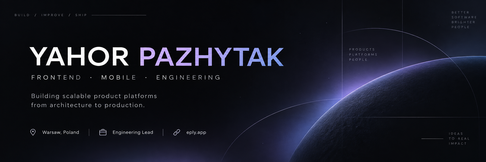
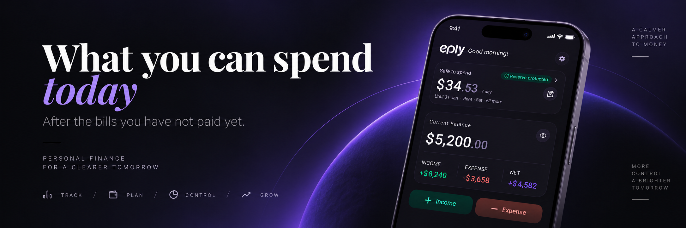

  

<h1 align="center">Yahor Pazhytak</h1>

  <strong>Head of Frontend & Mobile · Engineering Lead</strong>

  Building scalable web and mobile products with a focus on architecture, 
  platform engineering and long-term maintainability.

  Warsaw, Poland &nbsp;·&nbsp;
  <a href="https://eply.app">eply.app</a>

 

## 01 / Engineering

<table>
<tr >
<td width="50%" valign="top">

### Frontend & Mobile

Architecture and development of production web and React Native applications.

`TypeScript` `React` `React Native` `Expo`

</td>
<td width="50%" valign="top">

### Platform Engineering

Shared foundations that reduce duplication, improve developer experience and keep products consistent.

`Shared Libraries` `Design Systems` `API Contracts`

</td>
</tr>

<tr>
<td width="50%" valign="top">

### Delivery

Reliable engineering workflows from pull request to production.

`CI/CD` `Azure DevOps` `GitHub Actions` `Mobile Releases`

</td>
<td width="50%" valign="top">

### Leadership

Technical direction across architecture, people and product delivery.

`Roadmaps` `Hiring` `Mentoring` `Code Review`

</td>
</tr>
</table>

 

## 02 / Selected Work

### EPLY

**Founder**

**Personal finance, built for clarity.**

A personal finance product designed and engineered end-to-end across product experience, mobile architecture, data, security and delivery.

  

`React Native` · `Expo` · `TypeScript` · `SQLite` · `Offline-first`

→ **[eply.app](https://eply.app)**

 

### Valetax — Fintech Platform

**Head of Frontend & Mobile · Engineering Lead**

**Production fintech at scale**

Leading frontend and mobile engineering for an international fintech platform serving hundreds of thousands of users across multiple regions.

<table>
<tr>
<td align="center" width="33%">

<h2>35+</h2>

Payment providers

</td>
<td align="center" width="33%">

<h2>90+</h2>

Payment flows

</td>
<td align="center" width="33%">

<h2>6</h2>

Engineers led

</td>
</tr>
</table>

My work spans:

- frontend and React Native architecture
- modular payment platform design
- shared frontend and mobile foundations
- backend contract generation and type-safe integrations
- mobile release architecture
- CI/CD and developer experience
- technical roadmaps and engineering processes

 

## 03 / Engineering Principles

> Good architecture should make the common path simple, keep complexity contained and allow the product to evolve without continuously rewriting its foundations.

I enjoy engineering problems that live beyond individual features — architecture, platform foundations, developer experience, delivery systems and technical decisions that influence how products evolve over time.

 

## 04 / Toolbox

**Core**

`TypeScript` · `JavaScript` · `React` · `React Native` · `Expo`

**State & Data**

`TanStack Query` · `Zustand` · `Redux`

**Platform & Delivery**

`Azure DevOps` · `GitHub Actions` · `Yarn Workspaces` · `Lerna` · `Semantic Release`

**Tooling**

`Orval` · `Backend Contract Generation`

**Quality & Observability**

`Vitest` · `Jest` · `React Testing Library` · `Sentry` · `Firebase Crashlytics`

 

## 05 / Current Focus

<table>
<tr>
<td align="center" width="25%">

**Mobile**

Architecture

</td>
<td align="center" width="25%">

**Frontend**

Platforms

</td>
<td align="center" width="25%">

**Developer**

Experience

</td>
<td align="center" width="25%">

**Product**

Engineering

</td>
</tr>
</table>

 

---

  <strong>Build products. Simplify systems. Improve the foundations.</strong>

  <a href="https://eply.app">EPLY</a>

